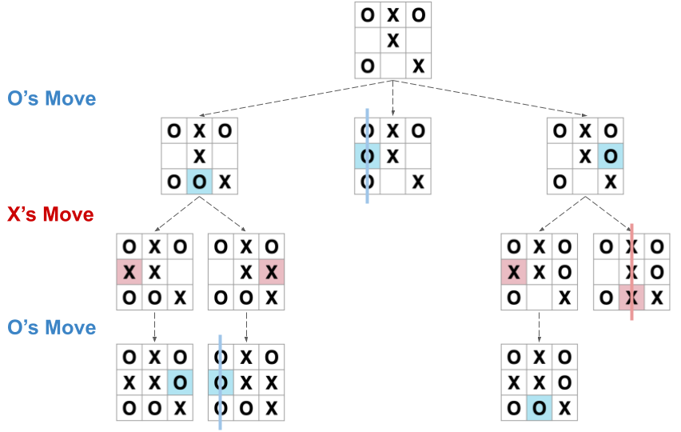
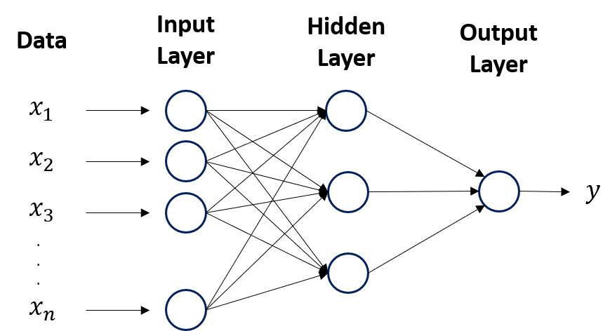
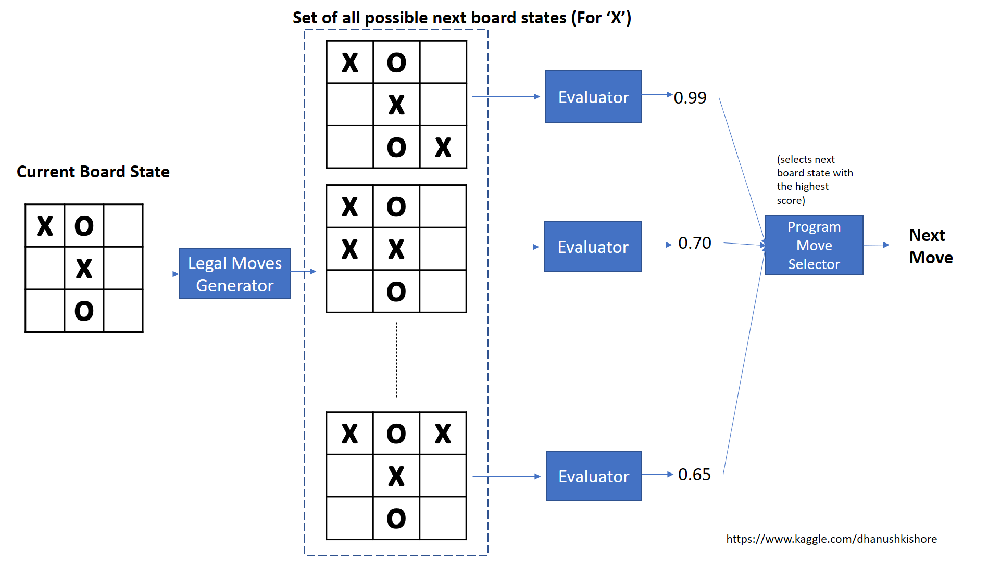
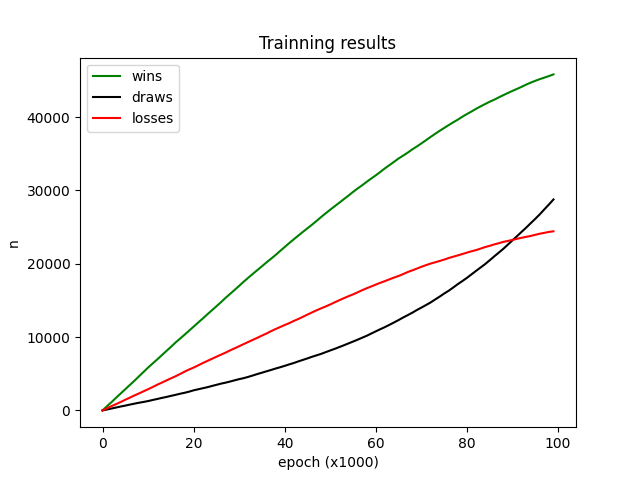
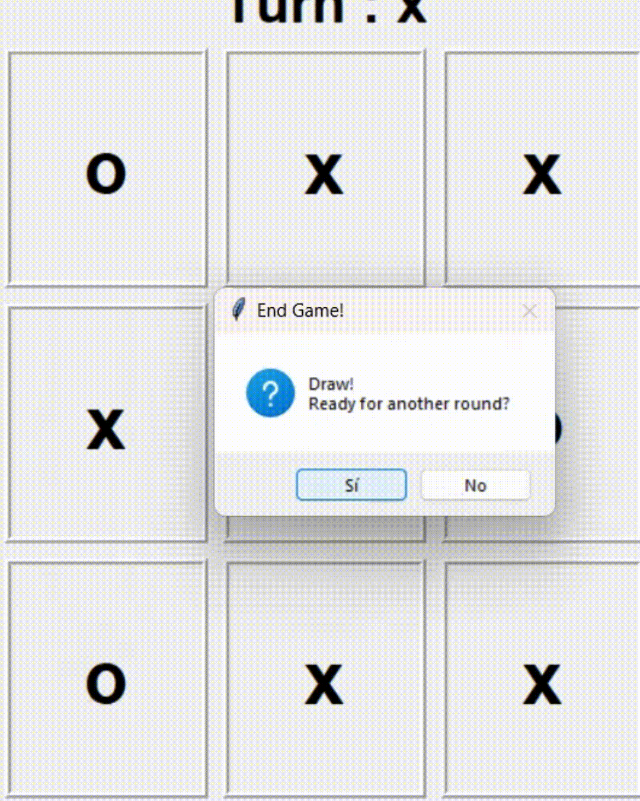
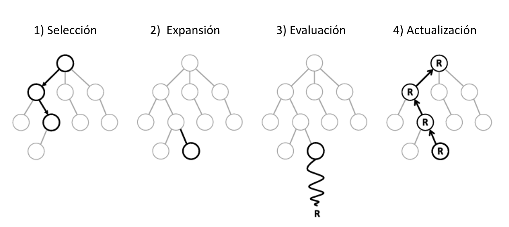

# Introducción a diferentes modelos de IA

En este repositorio comparamos 3 tipos de algoritmos: 

 1) Algoritmo Minimax
 2) Redes neuronales
 3) Aprendizaje por refuerzo
 4) Árboles de Búsqueda de Monte Carlo 

He creado un [PDF]() en el que explico una introducción de cada una de las 3 ramas mencionadas anteriormente.

Para visualizar resultados, creamos un modelo de cada tipo y los entrenamos para jugar al 3 en raya. Aquí proporciono un pequeña introducción a cada uno de los algoritmos y después explico el código que he desarrollado para cada uno, por lo que si ya se tiene una noción básica del algoritmo se puede pasar directamente a esta segunda parte.

#### Librerías necesarias

 - numpy: para fórmulas matemáticas y números aleatorios.
 - tkinter: para los gráficos del juego.
 - pytorch: para la red neuronal.

# Índice

 1. [Algoritmo Minimax](#id1)
    - [Explicación del código](#id1.1)

 2. [Redes neuronales](#id2)
    - [Explicación del código](#id2.1)

 3. [Aprendizaje por refuerzo](#id3)
    - [Explicación del código](#id3.1)

 4. [Árboles de Búsqueda de Monte Carlo](#id4)
    - [Explicación del código](#id4.1) 

## Minimax <a name=id1></a>



El algoritmo Minimax es una técnica fundamental en la teoría de juegos y la inteligencia artificial. Se utiliza para la toma de decisiones en situaciones competitivas de suma cero, donde dos jugadores se enfrentan en un juego de estrategia.

En el contexto matemático, consideremos un juego con información perfecta y un árbol de juego completo. Sea G un juego entre dos jugadores, llamémoslos Jugador 1 (Max) y Jugador 2 (Min). Cada nodo del árbol de juego representa un estado del juego, y las aristas que salen de un nodo representan las posibles acciones o movimientos que se pueden tomar.

El objetivo del algoritmo Minimax es determinar la mejor jugada para Jugador 1 (Max) en cada estado del juego, asumiendo que Jugador 2 (Min) también juega de manera óptima. Esto se logra mediante una exploración exhaustiva del árbol de juego, utilizando una estrategia de retroceso (backtracking) para evaluar los posibles resultados de cada movimiento.

### Explicación del código <a name=id1.1></a>

## Redes neuronales <a name=id2></a>



Las redes neuronales tipo perceptrón son un enfoque fundamental en el aprendizaje automático y la inteligencia artificial. En el contexto del juego del tres en raya, se pueden utilizar para automatizar el juego y tomar decisiones estratégicas.

El perceptrón es la unidad básica de una red neuronal, que combina entradas ponderadas y aplica una función de activación para generar una salida. En este caso, las entradas representan el estado actual del tablero y las salidas indican la mejor jugada posible.

El entrenamiento implica ajustar los pesos y sesgos del perceptrón utilizando ejemplos de entrada y salida esperada. El objetivo es desarrollar una red neuronal entrenada que juegue al tres en raya de manera competente, mejorando la experiencia de juego y explorando conceptos en el aprendizaje automático.

### Explicación del código <a name=id2.1></a>

*Observación: El código está desarrollado en la carpeta **ANN/** (Artificial Neural Network). Para el entrenamiento hemos usado el objeto **ANN_trainner** del script **model.py**. Finalmente, guardaremos el modelo resultante (la red neuronal) en la carpeta models (concretamente con la librería de pytorch) y para poder jugar usaremos el objeto **ANN_Model** y moveremos con la función propia, **move**.*

Para su entrenamiento, esta rebirá como entrada un vector de longitud 9 (las casillas del juego) mapeadas de la siguiente manera:

 - 1 si está la ficha "x".
 - -1 si está la ficha "o".
 - 0 si está la casilla vacía.

y para la salida proporcionaremos un vector (de longitud 9) que indique la probabilidad de realizar cada una de las acciones, gracias a la función [softmax](https://es.wikipedia.org/wiki/Funci%C3%B3n_SoftMax).

## Aprendizaje por refuerzo <a name=id3></a>



El Aprendizaje por Reforzamiento es un enfoque de la inteligencia artificial donde un agente aprende a tomar decisiones óptimas interactuando con su entorno y recibiendo retroalimentación en forma de recompensas. 

El algoritmo Q-learning es una técnica destacada en este campo. Busca aprender una función de valor óptimo llamada Q-función, que asigna valores a pares de estado-acción y representa la utilidad esperada a largo plazo. Mediante la exploración y explotación, el agente actualiza iterativamente los valores de la Q-función utilizando la regla de actualización de Q. Una vez que la Q-función ha convergido a su valor óptimo, el agente puede tomar decisiones óptimas eligiendo la acción con el mayor valor Q en cada estado.

### Explicación del código <a name=id3.1></a>

*Observación: El código está desarrollado en la carpeta **RL/** (Reinforcement Learning). Para el entrenamiento hemos usado el objeto **Q_trainner** del script **model.py**. Finalmente, guardaremos el modelo resultante (la tabla Q-table) en la carpeta models (concretamente con la librería pickle) y para poder jugar usaremos el objeto **RL_Model** y moveremos con la función propia, **move**.*

Primero creamos la Q-table vacía, es decir, para cada una de las posibles combinaciones del juego, creamos una fila de 9 elemento en los que iremos modificando para conseguir el mejor movimiento en cada jugada. 

La única información que tiene el juego es el siguiente movimiento, es decir, si en el siguiente movimiento:

 - Ganamos: ```q_next = 1```
 - Perdemos: ```q_next = -1```
 - Empatamos: ```q_next = 0```

Un vez tenemos dicha información, podemos empezar a simular partidas de prueba para completar la tabla lo mejor posible. Para este último paso utilizamos la función **updateQtable()** del objeto **Q_trainner**. Si no terminamos justo en el siguiente movimiento entonces tendremos que que actualizar el valor con el siguiente mejor Q posible, ```q_next = self.chose_best_action(next_game.board, q=True)```. Finalmente actualizamos la tabla de la siguiente forma: 

```python
q_new = (1 - self.alpha) * q0 + self.alpha * (reward + q_next)
```

Tras una serie de iteraciones obtenemos buenos resultados. Podemos ver la evolución del entrenamiento en el siguiente gráfico:



El modelo final en la práctica, pese a no realizar los movimientos óptimos siempre, evita perder en todas la ocasiones y además si no se efectuan los movientos correctos, también es capaz de ganar al oponente. Aquí podemos ver un par de ejemplos:

| Jugada | Explicación |
|--------|-------------|
|  | **Empate:** la IA es el jugador "O". Podemos observar como siempre evita que el "X" gane. |
|  | **Gana la IA:** la IA es el jugador "X". Podemos observar como la IA le deja sin movimientos al oponente y consigue ganarle. |


## Árboles de Búsqueda de Monte Carlo <a name=id4></a>



Los Árboles de Búsqueda de Monte Carlo (MCTS) son una técnica eficiente para la toma de decisiones en juegos y problemas de búsqueda. Utilizando simulación Monte Carlo y la construcción de un árbol de búsqueda, el MCTS busca encontrar la mejor acción en un estado dado, maximizando la recompensa a largo plazo. 

Durante la selección, se eligen nodos para la exploración y expansión, seguidos de simulaciones Monte Carlo para estimar la recompensa. Los valores de los nodos se actualizan usando la regla de copia de respaldo. Este proceso se repite hasta alcanzar un límite de tiempo o un criterio de terminación. 

### Explicación del código <a name=id4.1></a>


